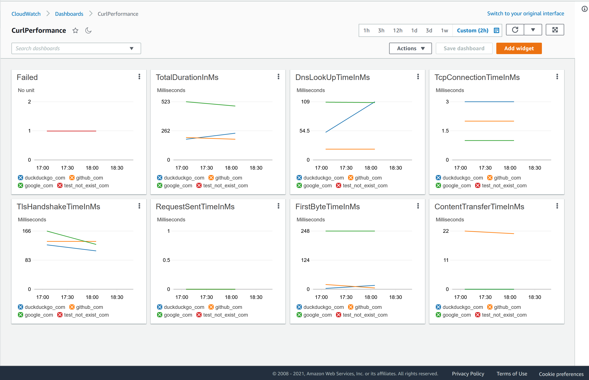

# curl-performance-test-tool

A simple tool to benchmark http latency with `curl`.

For details of the timings see [Cheat Sheet on Curl Performance Metrics: how to benchmark server latency with curl](https://speedtestdemon.com/a-guide-to-curls-performance-metrics-how-to-analyze-a-speed-test-result/).

---

The [deploy-curl-performance-test-master](https://github.com/kyhau/curl-performance-test-tool/actions/workflows/deploy-curl-performance-test-master.yaml) workflow
- Deploy a AWS Lambda Function that runs `curl` on the given list of URLs regularly (every `15 minutes` by default).
- Produce the following set of CloudWatch Custom Metrics under the a custom Namespace (e.g. `CurlPerformance`.
    1. DnsLookUpTimeInMs
    2. TcpConnectionTimeInMs
    3. TlsHandshakeTimeInMs
    4. RequestSentTimeInMs
    5. FirstByteTimeInMs
    6. ContentTransferTimeInMs
    7. TotalDurationInMs
    8. Failed (unit: None)
- Produce a CloudWatch Dashboard named `CurlPerformance`.



### Specifying URLs to be tested

- The [upload-input-files-to-s3](https://github.com/kyhau/curl-performance-test-tool/actions/workflows/upload-input-files-to-s3.yaml) workflow uploads the URL input files in [inputs/](inputs/) to a S3 bucket which is read by the Lambda Function.

- URLs are specified in the corresponding `inputs/<AccountId>-<Region>.json` file.

- In the example below, `github_com` is used for the CloudWatch Metric Dimension `Id` in the Namespace `CurlPerformance`.

    ```json
    {
      "github_com": {
        "Url": "https://github.com"
      }
    }
    ```

- To add URLs
    1. Add the URLs to the corresponding `inputs/<AccountId>-<Region>.json`.
    2. Merge the change.
    3. The workflow will be triggered automatically to upload the file to the S3 bucket and recreate the CloudWatch Dashboard.

### To deploy a new stack to a new AWS account or a new Region

1. Edit [.github/workflows/deploy-curl-performance-test.yaml](.github/workflows/deploy-curl-performance-test.yaml) - add VPC ID and Subnet IDs to the step with id `VpcInfo`.
2. Edit [.github/workflows/upload-input-files-to-s3.yaml](.github/workflows/upload-input-files-to-s3.yaml) - add the aws account alias to `accountenvironment`.
3. Create `inputs/<AccountId>-<Region>.json`.
4. Merge the change.
5. Trigger the workflow [deploy-curl-performance-test-master](https://github.com/kyhau/curl-performance-test-tool/actions/workflows/deploy-curl-performance-test-master.yaml).

### TODOs

1. The Lambda Function uses Python 3.7 Runtime which has `curl` installed in its Amazon Linux 1 environment.  Some work is required to update the Runtime to Python 3.8 or 3.9 which do not have `curl` installed in the Amazon Linux 2 environment.
